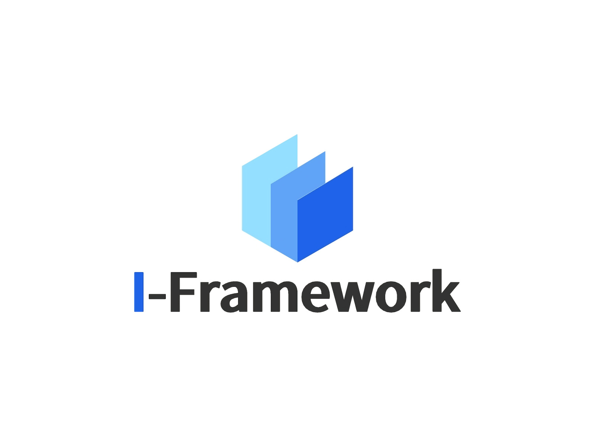

​	<center> English | [中文](https://github.com/Xxxxic/I-Framework/blob/master/README_zh.md) </center>

## Introduction

An intelligent background management system framework

Including login / registration / homepage / menu switch function

One of the sample interfaces is the Product-management-list, which contains additions, deletions and changes to data

*The above data are only tested on local simulated data*

## Project setup

**Make sure the Node environment are configured and run the following command on cmd**

### Compiles and hot-reloads for development

```
npm run serve
```

<h3>Running simulation data

```
cd src/mock
npm run mock
```

### Compiles and minifies for production

```
npm run build
```

### Lints and fixes files

```
npm run lint
```

<h3>Directory structure

```
├── src					 👉 Project source code
│   ├── api              	# Request api
│   ├── assets              # Static resources like images
│   ├── components          # Global components
│   ├── config              # global configuration
│   ├── layout              # Main layout
│   ├── router              # Routing configuration
│   ├── store               # Global state management
│   ├── style               # Global style
│   ├── utils               # Global tool/method
│   ├── views               # Global single page component
│   ├── App.vue             # Entry page
│   └── main.ts             # Entry file
```

### Customize configuration

See [Configuration Reference](https://cli.vuejs.org/config/).

## Copyright©

<Copyright©  Xxxxic(Github)>

