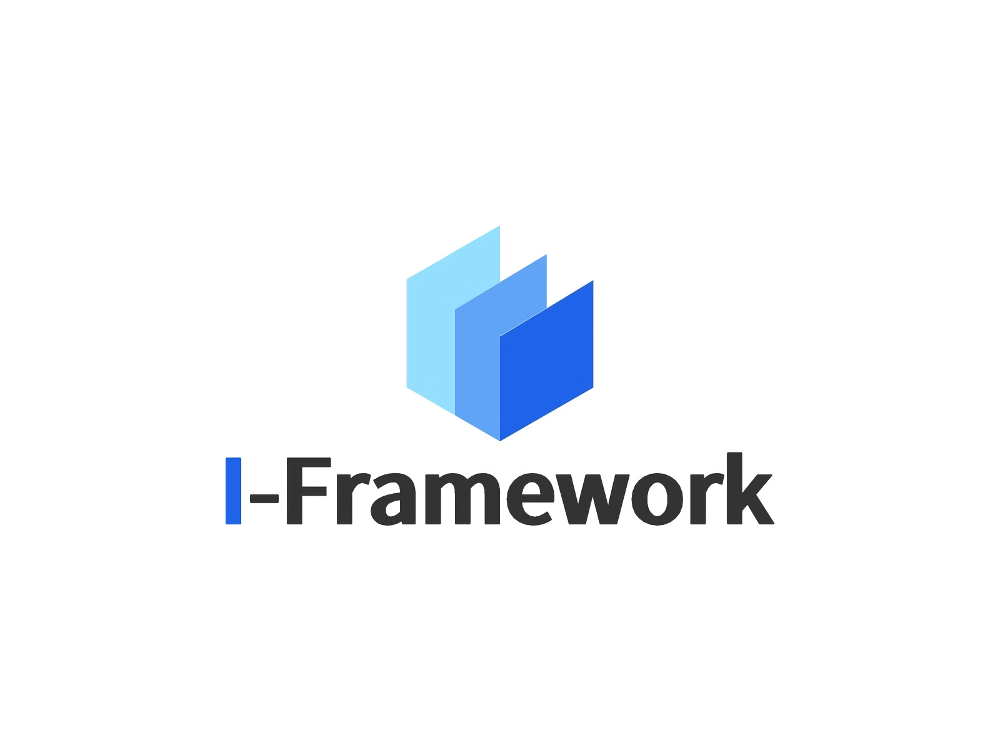

​						[English](https://github.com/Xxxxic/I-Framework/README.md) | 中文

## 简介

一个智能后台管理系统的框架

包括首页登录注册以及主界面菜单跳转切换界面的功能

其中一个样例界面是产品管理列表，包含对数据的增删查改

*以上数据均只在本地模拟数据中测试*

# 快速上手

首先确保已经配置好node环境以及vue，在命令行运行以：

### 编译加载启动

```
npm run serve
```

<h3> 运行模拟数据

```
cd到src的mock文件夹下:
npm run mock
```

### 生产模式

```
npm run build
```

### 检查和修复文件

```
npm run lint
```

<h3>核心项目结构

```
├── src					👉 项目源代码
│   ├── api              	# 请求 api
│   ├── assets              # 字体、图片等静态资源
│   ├── components          # 全局自定义公用组件
│   ├── config              # 项目源代码全局配置
│   ├── layout              # 主要页面布局
│   ├── router              # 路由配置
│   ├── store               # 全局状态管理
│   ├── style               # 全局样式
│   ├── utils               # 全局工具方法
│   ├── views               # 全局单页面组件
│   ├── App.vue             # 入口页面
│   └── main.ts             # 入口文件
```

### 自定义配置

参考 [Configuration Reference](https://cli.vuejs.org/config/).

## 许可证

<Copyright©  Xxxxic(Github)>

